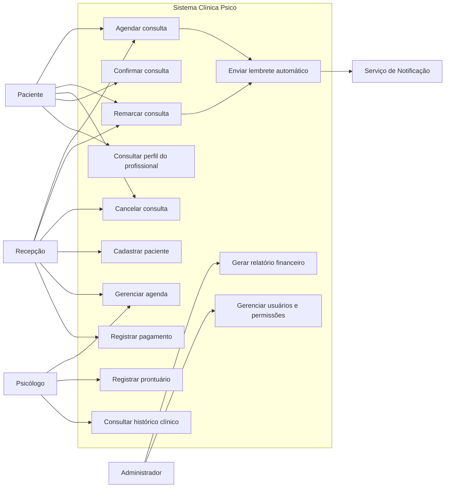

# Diagrama de Casos de Uso

## Atores

| Ator | Descrição |
| :--- | :--- |
| Paciente | Pessoa atendida pela clínica que agenda, confirma, remarca ou cancela consultas. |
| Recepção | Usuário administrativo que gerencia agenda, cadastro e pagamentos. |
| Psicólogo | Profissional que atende pacientes, acompanha agenda e registra prontuários. |
| Administrador | Usuário responsável por configurações, perfis e relatórios. |
| Serviço de Notificação | Integração externa para envio de WhatsApp ou e-mail. |

## Diagrama

## Observações

- O caso "Enviar lembrete automático" é acionado pelo agendamento ou remarcação.
- O prontuário não é acessível pela recepção.
- O administrador gerencia permissões, mas o acesso ao conteúdo clínico deve respeitar regras de autorização e responsabilidade profissional.

