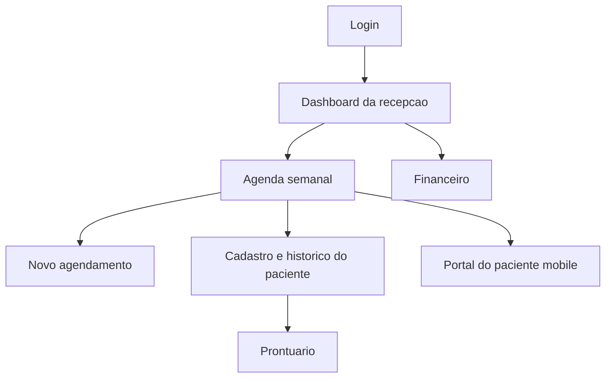

# Prototipos das Telas

## Link do Penpot

Status: gerado no Penpot.

- Penpot: https://design.penpot.app/#/workspace?team-id=8c927302-d076-8020-8007-fda9692d4d3c&file-id=6aafd946-1972-8152-8008-0a124a826386&page-id=6aafd946-1972-8152-8008-0a124a826387
- Projeto: Clinica Psico - 2a Etapa
- Arquivo: Clinica Psico - Prototipos 2a Etapa
- Telas criadas: Login, Dashboard da recepcao, Agenda semanal, Novo agendamento, Cadastro e historico do paciente, Prontuario, Financeiro e Portal do paciente mobile.

## Telas previstas

| Tela | Objetivo | Usuarios |
| :--- | :--- | :--- |
| Login | Autenticar usuarios e direcionar por perfil | Todos |
| Dashboard | Exibir visao resumida da rotina da clinica | Recepcao, Psicologo, Administrador |
| Agenda semanal | Visualizar consultas por semana, profissional, status e fila de espera | Recepcao, Psicologo |
| Novo agendamento | Criar consulta escolhendo paciente, profissional, data, sala e modalidade | Recepcao |
| Cadastro e historico do paciente | Consultar dados cadastrais, consentimentos e historico de atendimentos | Recepcao, Psicologo |
| Prontuario | Registrar e consultar evolucao clinica com controle de acesso | Psicologo |
| Financeiro | Controlar pagamentos pendentes, pagos, convenios e inadimplencia | Recepcao, Administrador |
| Portal do paciente mobile | Confirmar consulta, remarcar, enviar comprovante e consultar avisos | Paciente |

## Fluxo de navegacao

## Diretrizes visuais

- Interface web para recepcao, psicologo e administrador, com complemento mobile para paciente.
- Uso de cores calmas e profissionais, com destaque por status sem deixar a tela monocromatica.
- Separacao clara entre agenda, prontuario e financeiro.
- Status de consulta com distincao visual: confirmado, aguardando, online, convenio, retorno e triagem.
- Status financeiro com distincao visual: pago, pendente, aberto e convenio.
- Tela de prontuario com destaque para privacidade, controle de acesso e logs.
- Portal do paciente com acoes simples: confirmar presenca, remarcar, enviar comprovante e falar com a recepcao.

## Componentes principais

| Componente | Uso |
| :--- | :--- |
| Barra lateral | Navegacao por modulos conforme perfil do usuario. |
| Barra superior | Busca, identificacao da clinica e perfil ativo. |
| Cards de indicadores | Consultas do dia, confirmacoes, pendencias e recebimentos. |
| Agenda semanal | Organizacao visual dos horarios por dia e fila de espera. |
| Formularios | Cadastro, agendamento e registro financeiro. |
| Tabelas | Listagem de pacientes, consultas, historico e pagamentos. |
| Editor clinico | Registro de evolucao no prontuario. |
| Portal mobile | Interface simplificada para o paciente confirmar e acompanhar consultas. |
