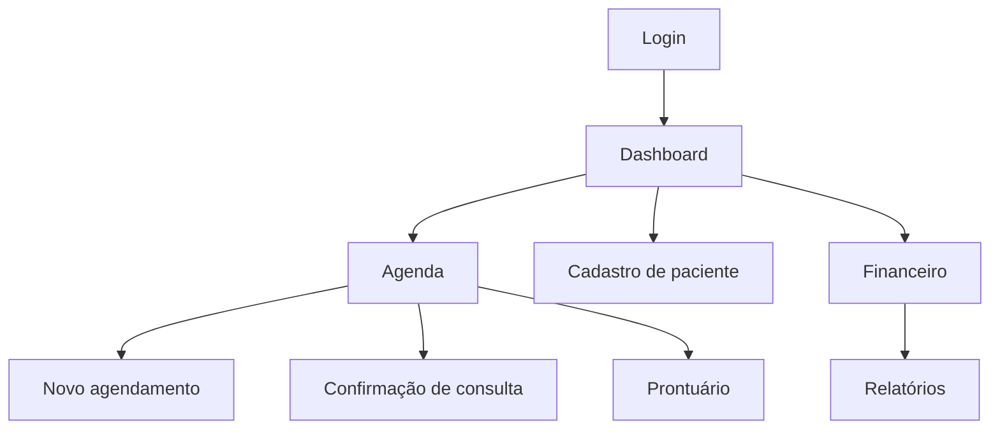

# Protótipos das Telas

## Link do Figma

Status: gerado.

- Figma: https://www.figma.com/design/t5RwygZuYqmiNANNhpA7Om
- Arquivo: Projeto Clínica Psico - Protótipos
- Telas criadas: Login, Dashboard Recepção, Agenda, Novo Agendamento, Confirmação do Paciente, Prontuário, Financeiro e Relatórios.

## Telas previstas

| Tela | Objetivo | Usuários |
| :--- | :--- | :--- |
| Login | Autenticar usuários e direcionar por perfil | Todos |
| Dashboard | Exibir visão resumida da rotina da clínica | Recepção, Psicólogo, Administrador |
| Agenda | Visualizar consultas por dia, profissional e status | Recepção, Psicólogo |
| Novo agendamento | Criar consulta escolhendo paciente, profissional, data e modalidade | Recepção, Paciente |
| Confirmação de consulta | Permitir confirmação, cancelamento ou remarcação | Paciente |
| Cadastro de paciente | Registrar dados cadastrais e contato | Recepção |
| Prontuário | Registrar e consultar evolução clínica | Psicólogo |
| Financeiro | Controlar pagamentos pendentes e concluídos | Recepção, Administrador |
| Relatórios | Acompanhar faltas, pagamentos e agenda | Administrador |

## Fluxo de navegação

## Diretrizes visuais

- Interface web responsiva.
- Uso de cores calmas e profissionais.
- Status de consulta com distinção visual: agendada, confirmada, realizada, cancelada e falta.
- Status financeiro com distinção visual: pendente, pago, parcial e estornado.
- Separação visual clara entre módulo administrativo e módulo clínico.
- Tela de prontuário sem exposição desnecessária de dados sensíveis.

## Componentes principais

| Componente | Uso |
| :--- | :--- |
| Barra lateral | Navegação por módulos conforme perfil do usuário. |
| Calendário / agenda | Exibição de horários e consultas. |
| Cards de resumo | Indicadores de consultas do dia, pendências e pagamentos. |
| Formulário | Cadastro de paciente, agendamento e registro financeiro. |
| Tabela | Listagem de pacientes, consultas e pagamentos. |
| Editor de texto simples | Registro de evolução clínica no prontuário. |
| Modal de confirmação | Confirmar ações críticas como cancelamento e estorno. |
