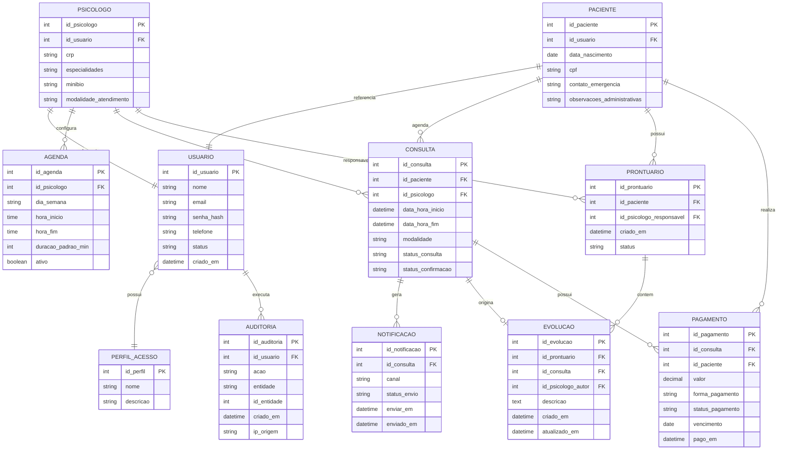

# Modelo Entidade Relacionamento

## Diagrama ER

## Regras de Relacionamento

- Um usuário possui um perfil de acesso.
- Um paciente referencia um usuário.
- Um psicólogo referencia um usuário.
- Um psicólogo possui uma ou mais agendas.
- Uma consulta pertence a um paciente e a um psicólogo.
- Uma consulta pode gerar notificações.
- Um paciente pode possuir prontuário por psicólogo responsável.
- Uma evolução pertence a um prontuário e pode estar vinculada a uma consulta.
- Uma consulta pode possuir um ou mais registros de pagamento.
- A auditoria registra ações sensíveis executadas por usuários.

